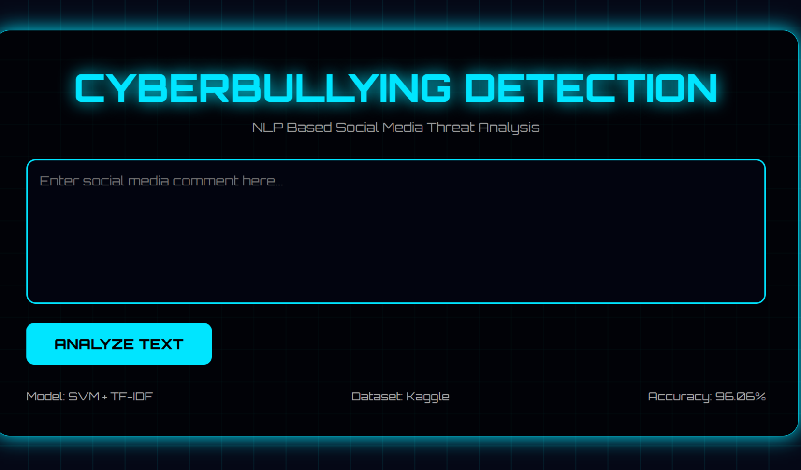
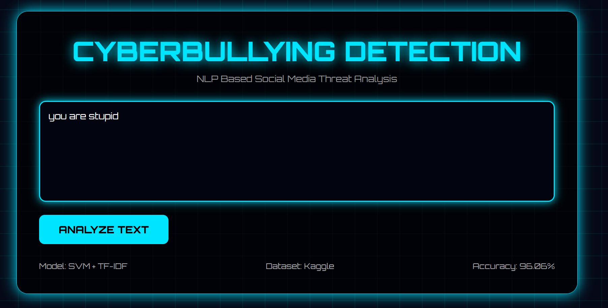
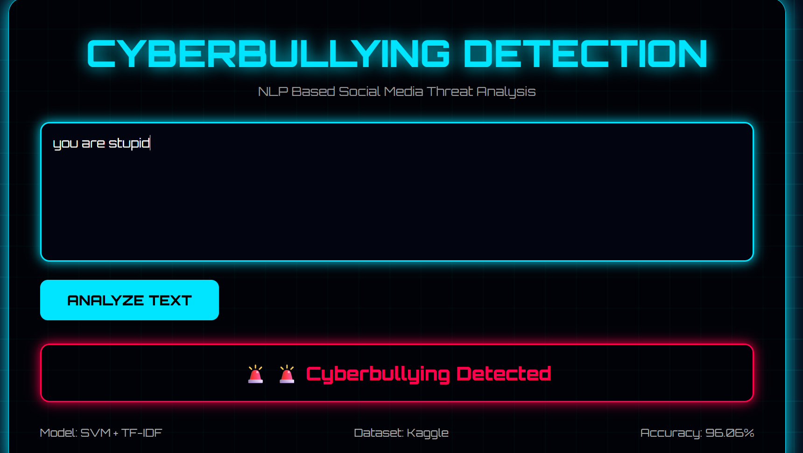

# 🛡️ Cyberbullying Detection on Social Media

A Machine Learning-based web application that detects cyberbullying content in social media text using Natural Language Processing (NLP) and Support Vector Machine (SVM). The system classifies user input as either **Cyberbullying** or **Non-Cyberbullying** through an intuitive Flask-based web interface.

---

## 📖 Project Overview

Cyberbullying has become one of the major challenges on social media platforms. This project aims to automatically detect offensive and harmful text using Machine Learning techniques to help create a safer online environment.

The application preprocesses user input using NLP techniques and predicts whether the given text contains cyberbullying content.

---

## 🚀 Features

- ✅ Detects cyberbullying text in real-time
- ✅ Machine Learning-based classification using SVM
- ✅ Natural Language Processing (NLP) for text preprocessing
- ✅ User-friendly Flask web application
- ✅ Simple and responsive interface
- ✅ Fast prediction results

---

## 🛠️ Technologies Used

| Technology | Purpose |
|------------|---------|
| Python | Programming Language |
| Flask | Web Framework |
| Scikit-learn | Machine Learning |
| Pandas | Data Processing |
| NumPy | Numerical Computing |
| NLTK | Natural Language Processing |
| HTML | Frontend Structure |
| CSS | User Interface Styling |
| Git & GitHub | Version Control |

---

## 📂 Project Structure

```
Cyberbullying_Detection/
│
├── app.py
├── templates/
├── notebook/
├── models/
├── results/
├── data/
└── screenshot/
```

---

## 📸 Application Screenshots

### 🏠 Home Page



---

### ✍️ User Input



---

### ✅ Prediction Result



---

## ⚙️ Installation

### Clone the Repository

```bash
git clone https://github.com/MathiBala-CS/Cyberbullying-Detection-on-Social-Media.git
```

### Navigate to the Project

```bash
cd Cyberbullying-Detection-on-Social-Media
```

### Install Required Libraries

```bash
pip install -r requirements.txt
```

### Run the Application

```bash
python app.py
```

---

## 🧠 Machine Learning Workflow

1. Data Collection
2. Data Cleaning
3. Text Preprocessing
4. Feature Extraction (TF-IDF)
5. Model Training (Support Vector Machine)
6. Model Evaluation
7. Web Deployment using Flask

---

## 📊 Model Information

**Algorithm Used:**

- Support Vector Machine (SVM)

**Natural Language Processing Techniques**

- Lowercase Conversion
- Punctuation Removal
- Stopword Removal
- Tokenization
- Lemmatization
- TF-IDF Vectorization

---

## 🎯 Project Objectives

- Detect cyberbullying content automatically.
- Improve online safety through AI.
- Demonstrate practical implementation of Machine Learning and NLP.
- Provide an easy-to-use web interface for prediction.

---

## 🔮 Future Enhancements

- Tanglish (Tamil-English) Cyberbullying Detection
- Deep Learning Models (LSTM/BERT)
- Real-time Social Media Integration
- Multi-language Support
- Explainable AI Predictions
- Higher Accuracy using Transformer Models

---

👨‍💻 Project Maintainer

Mathi Bala M (Team Lead)
Cyber Security Engineer | Machine Learning Enthusiast | Building Secure Digital Solutions

🤝 Team Members

This project was developed collaboratively by:

Mathi Bala M (Team Lead)
Aravind M
Sangaiya P

All members contributed equally to the design, development, and implementation of the project.
📧 Email: mathibalam62@gmail.com

🔗 LinkedIn:
https://www.linkedin.com/in/mathi-bala-m-015120291/

🔗 GitHub:
https://github.com/MathiBala-CS

🔗 ORCID:
(Add your ORCID profile link here)

---

## ⭐ Support

If you found this project useful, consider giving it a ⭐ on GitHub.

Feedback and suggestions are always welcome!
